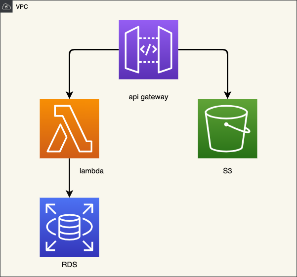

# サーバレスアーキテクチャによる静的ウェブサイト構築

<p align="center">
  
</p>


このリポジトリは、S3、API Gateway、Lambda、RDS、IAMを利用したサーバレス構築の概要を説明します。この構築は、Terraformを使用してIaC (Infrastructure as Code) を実現し、静的ウェブサイトのホスティング、APIゲートウェイによるリバースプロキシ、Lambda関数の実行、RDSデータベースの利用を実現します。

# 構成
このアーキテクチャは、以下のコンポーネントで構成されています。

+ S3: 静的コンテンツのホスティングに使用されます。
+ API Gateway: リバースプロキシとして動作し、S3 と Lambda へのリクエストを振り分けます。
+ Lambda: サーバレスアプリケーションのバックエンドロジックを実行するために使用されます。
+ RDS: データベースの保存に使用されます。
+ Terraform: インフラストラクチャをコードとして定義および管理するために使用されます。
+ IAM を使用したアクセス制御

# 動作
1. クライアントが API Gateway にリクエストを送信します。
2. API Gateway はリクエストを分析し、S3 または Lambda にルーティングします。
3. 静的コンテンツの場合は、API Gateway は S3 からファイルを直接返します。
4. 動的コンテンツの場合は、API Gateway は Lambda 関数を呼び出し、その結果を返します。
5. Lambda 関数は RDS からデータをリクエストします。
6. Lambda 関数は API Gateway に結果を返し、API Gateway はそれをクライアントに返します。

# 利点
このアーキテクチャには、以下のような利点があります。

+ スケーラビリティ: トラフィックが増加すると、自動的にスケールアップできます。
+ コスト効率: 使用した分だけ支払う従量課金制モデルです。
+ 運用管理: サーバーを管理する必要はありません。
+ 高可用性: 冗長構成により、高い可用性を提供します。

# 起動とデプロイ方法
1. 以下のコードを実行すると実行されます。
```
bin/terraform_apply
```

3. Resources/index.html のアップロード

    1. ローカル環境で resources/index.html ファイルを開きます。
    2. S3 バケットに resources/index.html ファイルをアップロードします。

2. API Gateway エンドポイントURLの取得
    1. AWS マネジメントコンソールで Amazon API Gateway サービスに移動します。
    2. API 一覧から、目的のAPIを選択します。
    3. Actions メニューから ステージ を選択します。
    4. ステージの詳細 画面が表示されたら、 URL をコピーします。

2. URLにアクセス
    1. ブラウザを開き、先ほどコピーしたURLにアクセスします。

# 停止方法
以下のコードを実行すると実行されます。
```
bin/terraform_destroy
```

# 結論
このサーバレスアーキテクチャは、スケーラブルで、コスト効率が高く、運用管理が容易なソリューションを提供します。 ただし、複雑性、ベンダーロックイン、パフォーマンスなどの制約事項もあります。

# Qiita記事

技術詳細はQiitaに記載しています。

[サーバレスアーキテクチャによる静的ウェブサイト構築](https://qiita.com/sugiyama404/items/8a53886b7c6caf9b3ab9)

# 注意事項

このプロジェクトは、テスト目的でのみ使用してください。 本番環境で使用する場合は、セキュリティ要件を満たすように設定してください。


# 参考資料
+ Amazon S3: https://aws.amazon.com/s3/
+ Amazon API Gateway: https://aws.amazon.com/apigateway/
+ AWS Lambda: https://aws.amazon.com/lambda/
+ Amazon RDS: https://aws.amazon.com/rds/
+ AWS IAM: https://aws.amazon.com/iam/
+ Terraform: https://www.terraform.io/

# 免責事項
このドキュメントは参考目的でのみ提供されており、いかなる保証もありません。


